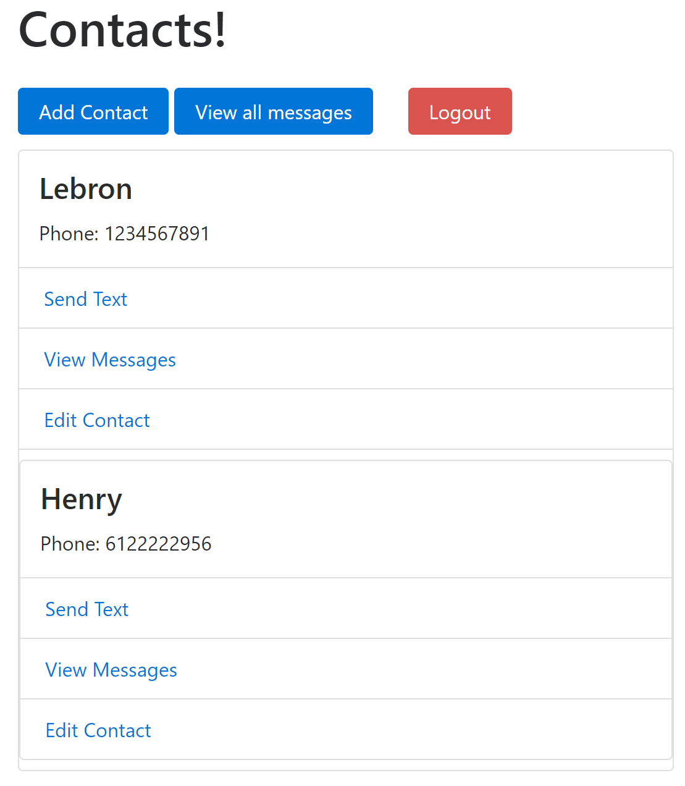
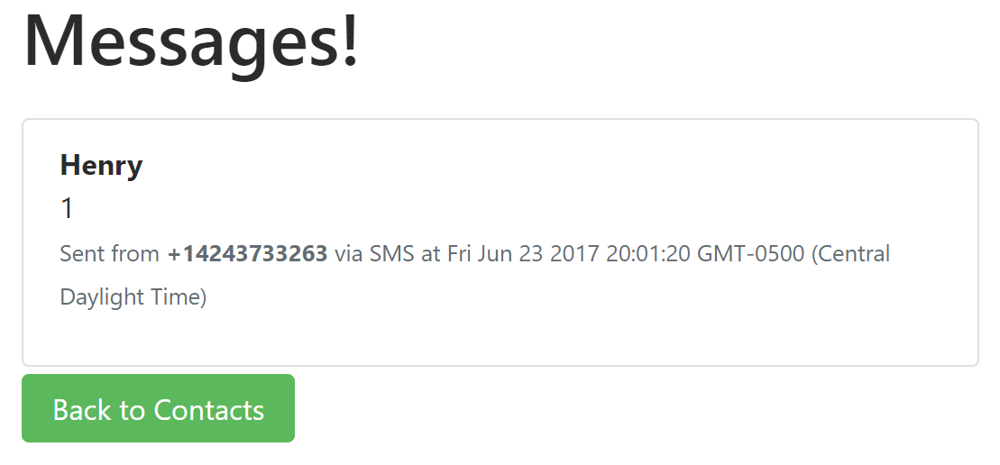
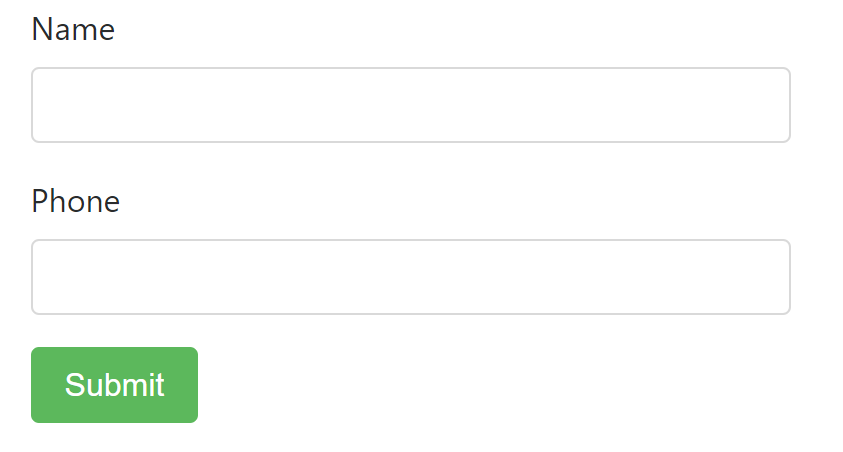
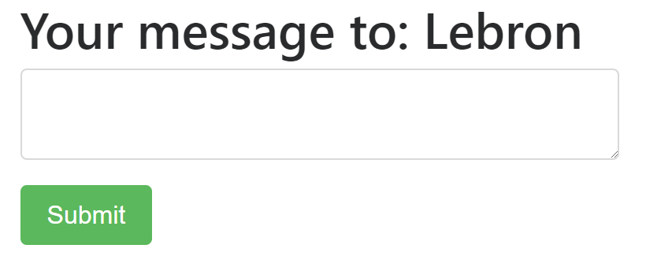

# Web Messenger
Website that sends text messages to and receive text messages from cellphones

## Project Purpose

Needed some practice with a full-stack project. Plus, there's no iMessage on PC.

## Main Features

### User Authentication

### Contact List

### View Messages

### New Contact

### Send Text Message

## Key Tools

Twilio, Node.js

## Acknowledgments

* Horizons School of Technology
